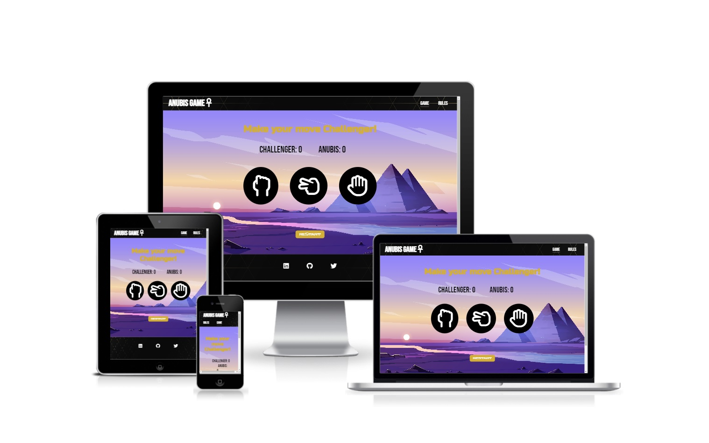
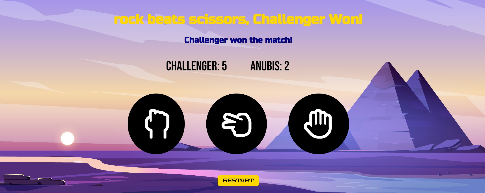

# Anubis Game
The rock, paper, scissors game with the title Anubis Game is a landing page for anybody who is looking for a excellent rock, paper, scissors game.
Anubis Game is a game to help friends, colleagues and family members to make decisions with a simple game that has a truly random result. It has been shown that people familiar with each other are statiscally more likely to draw when playing rock, paper, scissors. As the computer player in Anubis Game chooses randomly, the results of the game give a fairer result that playing with ones hands.

Users of this website will be able to play an amazing Rock, Paper, Scissors game and find all the information they need about Anubis Game rules and story on the website. This site will be targeted towards adults and children alike as a simple app to learn, practice and have fun.

# Features of Home Page

<h2>The Header</h2>
 
<ul>
    <li>
        
Feature at the top of the page, the naviagtion shows the game name in the left corner: Anubis Game that links to the home page.

    </li>
    <li>
        
The other navigation links are to the right: Game and Rules

    </li>
    <li>
        
Gameand Rules has a hoover style that underlines the page the user is on and change the color to gold color.

    </li>
    <li>
        
The navigation clearly tells the user the name of the game and website and makes the different sections of information easy to find.

    </li>
</ul>

<h2>The Game Section</h2>
 

 
<ul>
    <li>
        
On the top the User will find the winner of the round with the user choice and the computer choice.
  
    </li>
    <li>
        
Once the user score or the computer score reach the value of 5, the winner of the match is determined and an text in dark blue color will show up and tell the player who won the match.
  
    </li>
    <li>
        
Has a lovely image from a dessert and pyramids in a videogame style that gives a 2D retro game feeling to the users of the website.
  
    </li>
    <li>
        
It gives a score board to the user, so the user can keep track of who is winning the match.

    </li>
    <li>
        
The user also gets the Rock, Paper, Scissors buttoms option so he can select his or hers choice of preference 

    </li>
    <li>
        
Also the user can find in this section a "RESTART" buttom that restart the game once match winner is determined 

    </li>
</ul>

