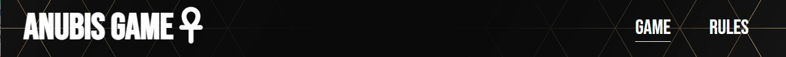

# Anubis Game
The rock, paper, scissors game with the title Anubis Game is a landing page for anybody who is looking for a excellent rock, paper, scissors game.
Anubis Game is a game to help friends, colleagues and family members to make decisions with a simple game that has a truly random result. It has been shown that people familiar with each other are statiscally more likely to draw when playing rock, paper, scissors. As the computer player in Anubis Game chooses randomly, the results of the game give a fairer result that playing with ones hands.

Users of this website will be able to play an amazing Rock, Paper, Scissors game and find all the information they need about Anubis Game rules and story on the website. This site will be targeted towards adults and children alike as a simple app to learn, practice and have fun.

# Features of Home Page

<h2>The Header</h2>
 
<ul>
    <li>
        
Feature at the top of the page, the naviagtion shows the game name in the left corner: Anubis Game that links to the home page.

    </li>
    <li>
        
The other navigation links are to the right: Game and Rules

    </li>
    <li>
        
Gameand Rules has a hoover style that underlines the page the user is on and change the color to gold color.

    </li>
    <li>
        
The navigation clearly tells the user the name of the game and website and makes the different sections of information easy to find.

    </li>
</ul>

<h2>The Game Section</h2>
 

 
<ul>
    <li>
        
Has a lovely image from the dessert and pyramids in a videogame style that gives a 2D retro game feeling to the users of the website.
  
    </li>
    <li>
        
On the top the User will find the winner of the round with the user choice and the computer choice.
  
        
    </li>
    <li>
        
Once the user score or the computer score reach the value of 5, the winner of the match is determined and an text in dark blue color will show up and tell the player who won the match.
  
        
    </li>
    <li>
        
The game section gives a score board to the user, so the user can keep track of who is winning the match.

        
    </li>
    <li>
        
The user also gets the Rock, Paper, Scissors buttoms option so he can select his or hers choice of preference 

        
    </li>
    <li>
        
Also the user can find in this section a "RESTART" buttom that restart the game once match winner is determined 

        
    </li>
</ul>

 
<h2>Game options and results</h2>
 
<ul>
    <li>
        
When the user clicks in one the rock, paper, scissors buttom the Java Script code chooses arandom option for the Computer player (in this case "Anubis").

    </li>
    <li>
        
Once the 2 choices are made in between the User and the Computer, the results are displayed on the top of the game section.

    </li>
    <li>
        
The winner will be the first who makes 5 point at the score section.

    </li>
    <li>
        
Once the 5 points are achieved, a text in dark blue color will be shown with the result of winner of the match, and the rock, paper, scissor option wont able to be selected anymore.

    </li>
</ul>
 

 
<<h2>Social media Section</h2>
<ul>
    <li>
        
This section has the Symbols from GitHub, Instagran and Linkedln and all of them are linked with gallegodev, developerer of this website, respective social media pages.
  
    </li>
    <li>
        
All the 3 Symbols have a hoover style so if the user has the arrow from the mouse pad on top of it the symbol will change color, giving the impression that the symbol is active and is functional to the user

    </li>

# Rules Page Features

<h2>Game rules Section</h2>
 
<ul>
    <li>
        
Gives to the user a quick introduction of the story of the game and how to win.

    </li>
    <li>
        
Explains to the user the Rock, Paper, Scissors options and what they do.

    </li>
    <li>
        
Also in this section the user will find how to win the match.

    </li>
</ul>

# 

